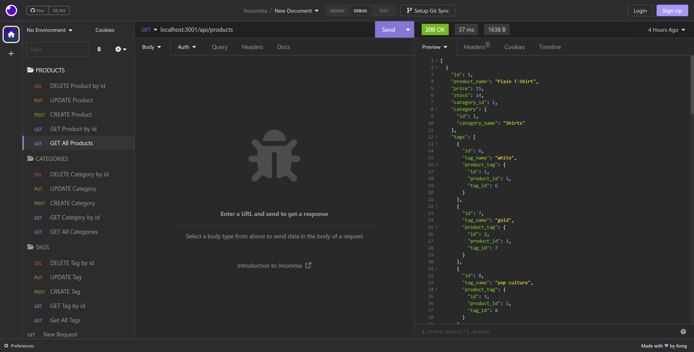

# 13-ORM-E-Commerce
This contains the Module 13 challenge of the Rice Coding Bootcamp

## Main Site

## Location of Repository

The source code is found in the server.js file, relevant sql code can be found within db/ folder, relevant connection code can be found within config/ folder, relevant model code can be found within models/ folder, relevant routes code can be found within routes/api/ folder, and relevant seed code can be found within seeds/ folder. All relevant images will be contained in the assets/images folder.

## Link to demo video

The demo video can be found here: https://drive.google.com/file/d/1LcQfO-j_G4_QSWEqmNnysJ0dBSbyLohg/view?usp=share_link